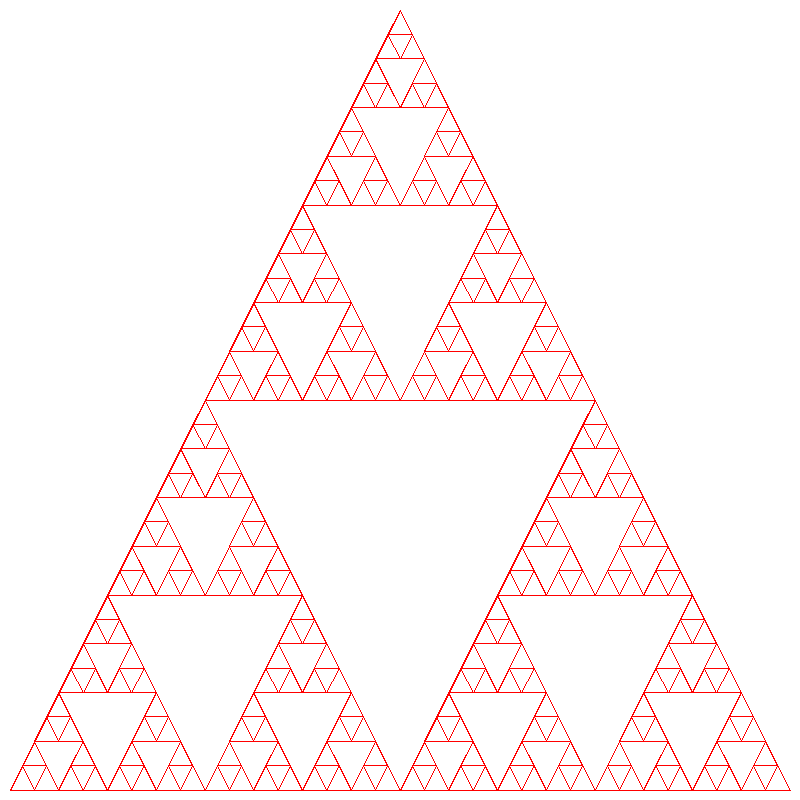

# Sierpinski Triangle Fractal Exercise Template

This is a placeholder for implementing the Sierpinski Triangle Fractal algorithm.

This project was originally created by Dr. Chris Tralie. You can contact him by email: chris.tralie@gmail.com.

This fork is maintained by Raydelto Hernandez (raydelto@raycasters.com).

## Cloning the repo

This repo has SimpleCanvas: another [Chris Tralie](https://www.linkedin.com/in/ctralie/) project, as a dependency. Therefore make sure to clone this repo recursively as follows:

`git clone git@github.com:raydelto/RecursiveDrawing.git --recurse`

## Building the source code

Building the project is almost trivial and platform agnostic. Just execute:

`make`

### KNOWN ISSUES
1. The Makefile clean target, i.e. `make clean` fails when executed on Windows PowerShell.

## Executing the binaries

Once you have built the project you can execute it as follows:

`./bin/main <output PNG size in pixels> <max depth> <output PNG file location>`

### Note:

The value of the first parameter will determine both the width and height of the PNG output file.

#### Example execution

`./bin/main 150 50 test.png`

This will generate a `150 x 150` pixels PNG image in a file named `test.png` with a Sierpinski Triangle Fractal of depth `50`.

## Coding your Fractal Implementation

Implement your fractal recursive drawing algorithm by writing an implementation for the `SierpinskiTriangle::drawRec` method located in `src/fractal.cpp`

## Expected Output

This is how the answer should look like:

